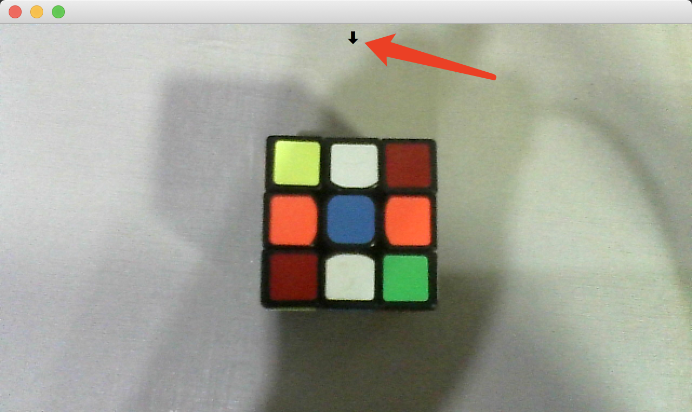

# QLabelCV
## A QLabel specially designed for OpenCV.
<br/>

###How to use:
```python
from PyQt5.QtWidgets import QApplication
from QLabelCV import QLabelCV
import sys


if __name__ == '__main__':
    app = QApplication(sys.argv)

    label_cv = QLabelCV()
    label_cv.show()
    label_cv.set_camera(0)

    sys.exit(app.exec_())
```

`set_camera()` is all you need to display video frames on QLabel. Pass different integers to enable different cameras:


You may draw a ROI rect on the screen:


You can get the rect coordinates using `get_rect()`:<br/>
```python
>>> print(label_cv.get_rect())
(161, 72, 316, 228)
```

Or
```python
>>> print(label_cv.roi_top_left_x)
161
>>> print(label_cv.roi_top_left_y)
72
>>> print(label_cv.roi_bottom_right_x)
316
>>> print(label_cv.roi_bottom_right_y)
228
```

You can also save the frame using `save_frame()`:
```python
>>> label_cv.save_frame(path='frame.jpg')
```
Save the frame with ROI rect:
```python
>>> label_cv.save_frame(path='frame.jpg', with_roi_rect=True)
```

Besides, you can click the little arrow on the screen to show the adjust area:



### Here is a demo using QLabelCV:
```python
from PyQt5.QtWidgets import QApplication, QWidget,QLabel, QPushButton, QSpinBox, QCheckBox, QHBoxLayout, QVBoxLayout
from QLabelCV import QLabelCV
import sys


class Demo(QWidget):
    def __init__(self):
        super(Demo, self).__init__()
        self.resize(640, 430)

        self.label_cv = None
        self.device_spin = None
        self.screenshot_btn = None
        self.print_coords_btn = None
        self.with_roi_rect_checkbox = None

        self.main()

    def main(self):
        self.init_ui()

    def init_ui(self):
        self.generate_widgets()
        self.connect_signals()
        self.set_layouts()

    def generate_widgets(self):
        self.label_cv = QLabelCV()
        self.label_cv.set_camera(0)
        self.device_spin = QSpinBox()
        self.screenshot_btn = QPushButton('ScreenShot')
        self.print_coords_btn = QPushButton('Print Coordinates')
        self.with_roi_rect_checkbox = QCheckBox('Save ROI Rect')

    def connect_signals(self):
        self.device_spin.valueChanged.connect(self.set_camera)
        self.screenshot_btn.clicked.connect(self.screenshot)
        self.print_coords_btn.clicked.connect(self.print_coordinates)

    def set_layouts(self):
        v_layout = QVBoxLayout()
        h_layout = QHBoxLayout()
        h_layout.addWidget(QLabel('Device:'))
        h_layout.addWidget(self.device_spin)
        h_layout.addStretch(1)
        h_layout.addWidget(self.screenshot_btn)
        h_layout.addWidget(self.with_roi_rect_checkbox)
        h_layout.addStretch(1)
        h_layout.addWidget(self.print_coords_btn)
        v_layout.addWidget(self.label_cv)
        v_layout.addLayout(h_layout)
        self.setLayout(v_layout)

    def set_camera(self):
        self.label_cv.set_camera(self.device_spin.value())

    def screenshot(self):
        if self.with_roi_rect_checkbox.isChecked():
            self.label_cv.save_frame('frame.jpg', True)
        else:
            self.label_cv.save_frame('frame.jpg')

    def print_coordinates(self):
        print('roi rect: ', self.label_cv.get_rect())
        print('roi_top_left_x: ', self.label_cv.roi_top_left_x)
        print('roi_top_left_y: ', self.label_cv.roi_top_left_y)
        print('roi_bottom_left_x: ', self.label_cv.roi_bottom_right_x)
        print('roi_bottom_left_y: ', self.label_cv.roi_bottom_right_y)


if __name__ == '__main__':
    app = QApplication(sys.argv)
    demo = Demo()
    demo.show()
    sys.exit(app.exec_())
```


